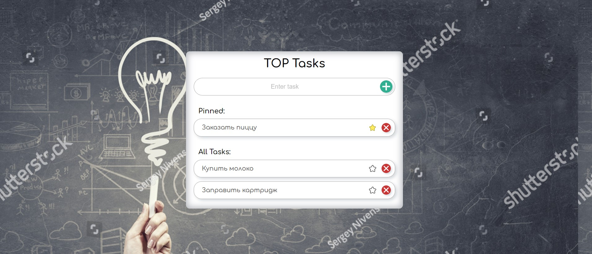

[GitHub Pages Top Task List](https://lekseff.github.io/AHJ_3-2/)

## TOP Tasks List

#### Описание

1. Добавлять задачи можно если в поле ввода есть текст (если текста нет, но пользователь всё равно пытается добавить выводиться сообщение об ошибке).
2. При добавлении задачи задача добавляется в блок "All Tasks".
3. Когда закреплённых задач нет, в блоке "Pinned" должен отображаться текст "No pinned tasks".
4. Когда закреплённые задачи есть, они отображаются в блоке "Pinned" и не участвуют в процедуре фильтрации:
    * их отображение никак не зависит от состояния фильтра
    * они не отображаются в блоке "All Tasks"
5. При пустом поле ввода в блоке "All Tasks" отображаются все задачи с учётом условий предыдущего пункта (т.е. все, кроме "Pinned").
6. При изменении поля ввода содержимое блока "All Tasks" автоматически пересчитывается - отображаются только те задачи, название которых начинается с того, что введено в поле ввода (без учёта регистра).
7. Если значению поля ввода не удовлетворяет ни одна из задач, то в блоке "All Tasks" отображается текст "No tasks found".
8. При нажатии на звездочку задача из блока "All Tasks" попадает в "Pinned".
9. При повторном нажатии на звездочку задача из блока "Pinned" попадает в блок "All Tasks".
