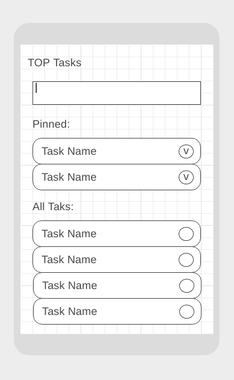

### TOP Tasks* (задача со звёздочкой)

Важно: эта задача не является обязательной. Её (не)выполнение не влияет на получение зачёта по ДЗ.

#### Легенда

Вы разрабатываете трекер задач, в котором есть возможность отображать назначенные пользователю задачи. Выглядеть это должно примерно так, как на экране:

Пользователь может фильтровать и добавлять (вот так вот решили проектировщики и заказчик приложения) задачи с помощью поля ввода. Некоторые задачи можно закреплять ("pin").

#### Описание

1. Добавлять задачи можно при следующих условиях: в поле ввода есть текст и пользователь нажал "Enter" (если текста нет, но пользователь всё равно нажал "Enter" должно выводиться сообщение об ошибке - предложите, как это сделать (ни в коем случае не alert и не console.*))
1. При добавлении задачи задача добавляется в блок "All Tasks", а поле ввода очищается
1. Когда закреплённых задач нет, в блоке "Pinned" должен отображаться текст "No pinned tasks"
1. Когда закреплённые задачи есть, они отображаются в блоке "Pinned" и не участвуют в процедуре фильтрации:
    * их отображение никак не зависит от состояния фильтра
    * они не отображаются в блоке "All Tasks"
1. При пустом поле ввода в блоке "All Tasks" отображаются все задачи с учётом условий предыдущего пункта (т.е. все, кроме "Pinned")
1. При изменении поля ввода содержимое блока "All Tasks" автоматически пересчитывается - отображаются только те задачи, название которых начинается с того, что введено в поле ввода (без учёта регистра)
1. Если значению поля ввода не удовлетворяет ни одна из задач, то в блоке "All Tasks" отображается текст "No tasks found"
1. При выставлении переключателя (круглая иконка справа) задача из блока "All Tasks" попадает в "Pinned"
1. При снятии переключателя (круглая иконка справа) задача из блока "Pinned" попадает в блок "All Tasks" (при этом учитывайте состояние фильтра)

Все задачи должны храниться в едином массиве в памяти JS. Каждая задача должна из себя представлять объект класса "Task" (который вы разработаете сами). Перестройка DOM-дерева должна происходить на основании объектов, хранящихся в памяти.

Всё должно собираться через Webpack (включая картинки и стили) и выкладываться на Github Pages через CI.